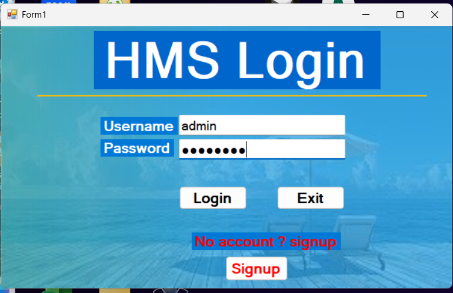
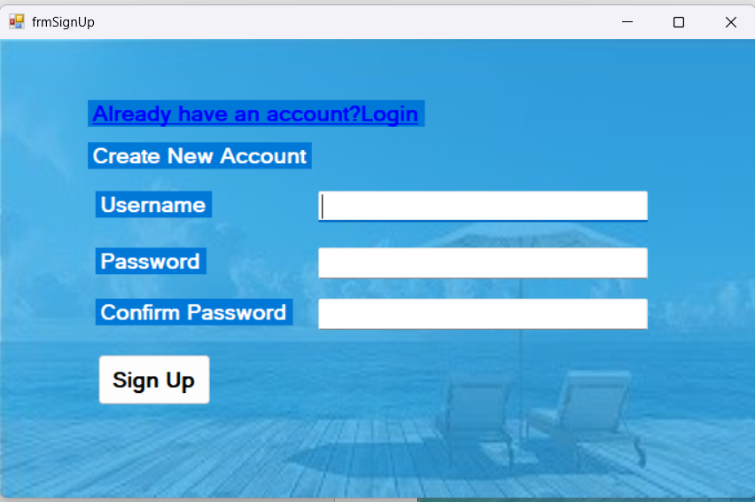
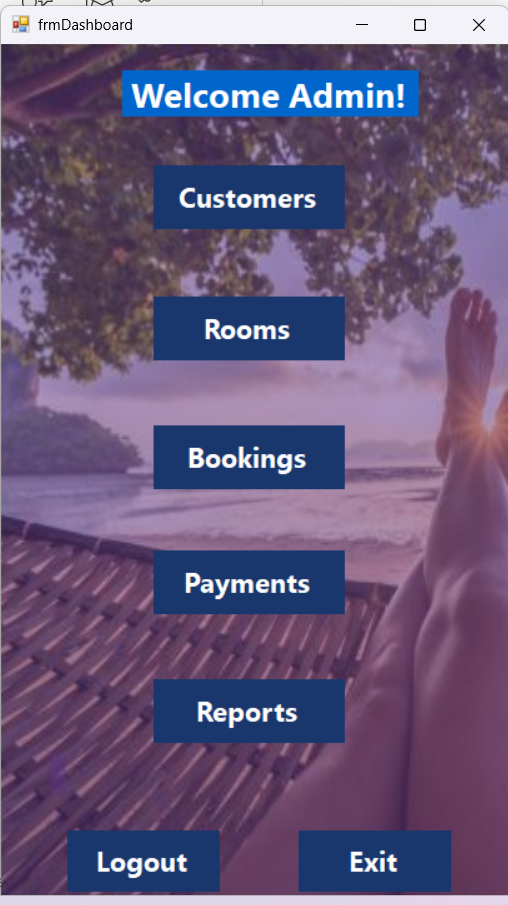
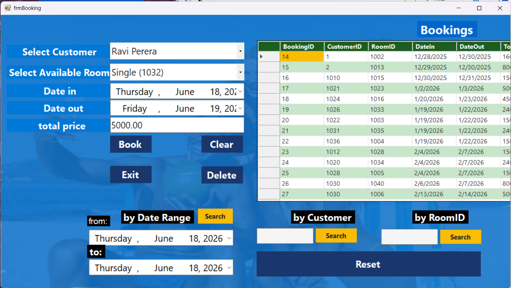
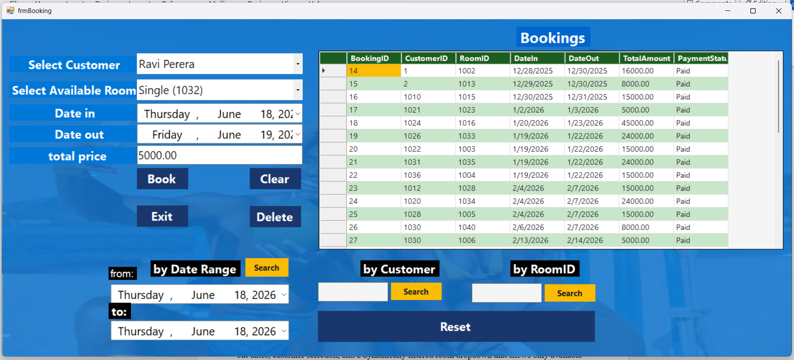
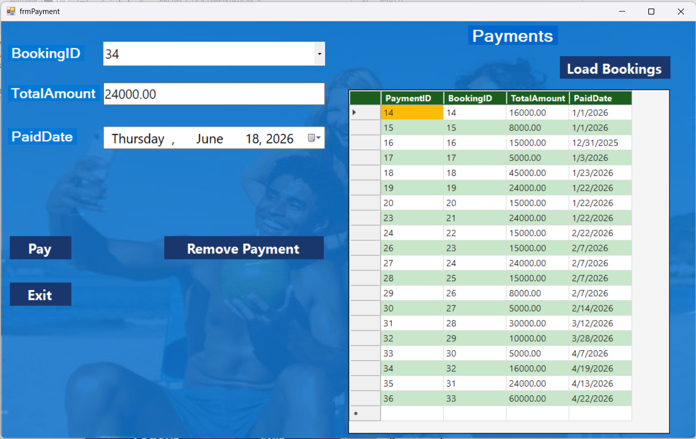
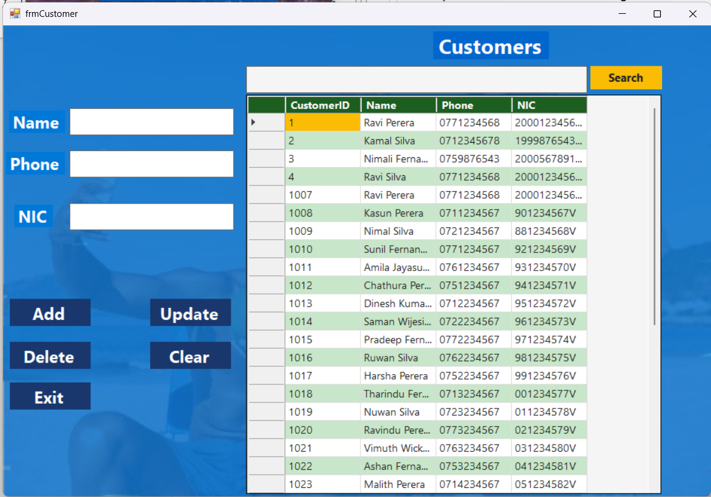
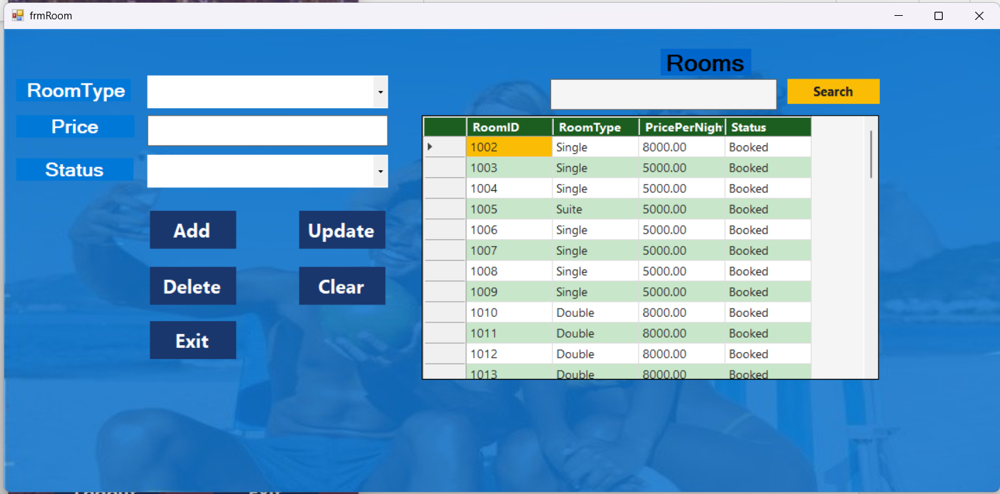
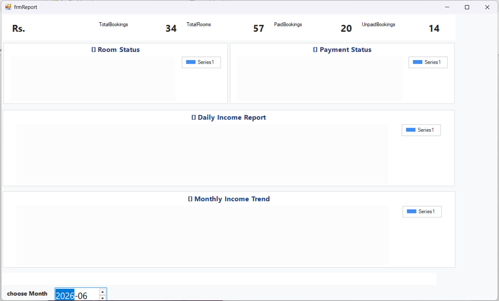
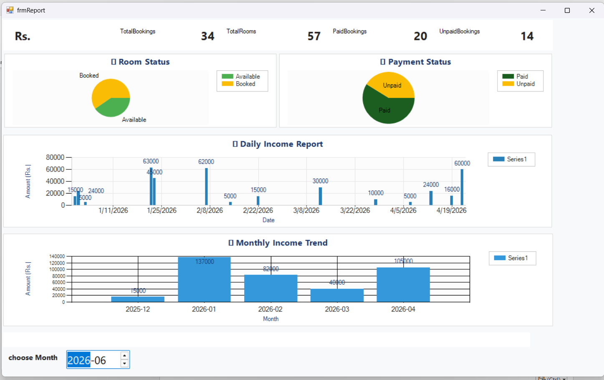

# 🏨 Hotel Management System

A desktop-based Hotel Management System built with **C# Windows Forms (.NET 4.7.2)** and **SQL Server LocalDB**, designed around a seaside/coastal hotel theme.

---

## 📸 Screenshots

### 🔐 Login


### 📝 Sign Up


### 🏠 Dashboard


### 📅 Bookings



### 💳 Payments


### 👥 Customers


### 🛏️ Rooms


### 📊 Reports



---

## ✨ Features

### 🔐 Authentication
- User login and signup with SQL Server validation
- Session-based navigation (Login → Dashboard → Modules)

### 🛏️ Room Management
- Add, update, delete rooms
- Room types: Single, Double, Deluxe, Suite
- Status tracking: Available, Booked, Maintenance
- Live search (300ms debounce) by room type, ID, or status

### 👥 Customer Management
- Add, update, delete customers
- Fields: Name, Phone, NIC
- Live search across all fields

### 📅 Booking Management
- **Date-aware room availability** — only shows rooms free for the selected date range
- Auto check-out date (check-in + 1 day)
- Auto total price calculation (nights × price/night)
- Double-booking prevention via SQL overlap detection
- Search bookings by customer name, room ID, or date range

### 💳 Payment Management
- Load unpaid bookings into dropdown
- Auto-fill amount and paid date from booking record
- Mark bookings as Paid on payment
- Remove payments (reverts booking to Unpaid)
- Auto-refresh grid after every operation

### 📊 Reports
- Summary cards: Total Income, Bookings, Rooms, Paid/Unpaid counts
- Charts: Daily Income, Room Status (pie), Payment Status (pie), Monthly Income Trend
- Powered by `System.Windows.Forms.DataVisualization`

---

## 🎨 Theme

Ocean/seaside-inspired color palette applied programmatically via `OceanTheme.cs`:

| Color | Hex | Usage |
|-------|-----|-------|
| Deep Blue | `#193D6D` | Backgrounds, headers |
| Primary Blue | `#2980B9` | Buttons |
| Bright Blue | `#3498DB` | Hover effects |
| Accent Yellow | `#FBBC05` | Search buttons, accents |
| Deep Green | `#1B5E20` | DataGrid headers |
| White | `#FFFFFF` | Input fields, card backgrounds |

All styling is applied in `Load` events and constructors — **Designer view is not used**.

---

## 🗄️ Database

**SQL Server LocalDB** — database name: `hotelDB`

### Tables

| Table | Key Columns |
|-------|-------------|
| `Users` | UserID, Username, Password |
| `Rooms` | RoomID, RoomType, PricePerNight, Status |
| `Customers` | CustomerID, Name, Phone, NIC |
| `Bookings` | BookingID, CustomerID, RoomID, DateIn, DateOut, TotalAmount, PaymentStatus |
| `Payments` | PaymentID, BookingID, TotalAmount, PaidDate |

### Connection String (`DB.cs`)
```
Data Source=(localdb)\MSSQLLocalDB;Initial Catalog=hotelDB;Integrated Security=True;TrustServerCertificate=True;
```

---

## ⚙️ Setup

### Prerequisites
- Visual Studio 2019 or later
- .NET Framework 4.7.2
- SQL Server LocalDB (ships with Visual Studio)

### Steps

1. **Clone the repository**
   ```bash
   git clone https://github.com/your-username/hotel-management-system.git
   ```

2. **Create the database**  
   Open SQL Server Management Studio (or LocalDB tools) and run `hotelDBscript.sql`

3. **Open the solution**  
   Open `HotelManagementSystem3.slnx` in Visual Studio

4. **Build and run**  
   Press `F5` or go to Debug → Start Debugging

### Default Login
```
Username: admin
Password: admin123
```

---

## 🛠️ Technologies

| Technology | Purpose |
|-----------|---------|
| C# / .NET 4.7.2 | Application logic |
| Windows Forms | UI framework |
| ADO.NET | Database access |
| SQL Server LocalDB | Data storage |
| System.Windows.Forms.DataVisualization | Charts in Reports |

---

## 📁 Project Structure

```
HotelManagementSystem3/
├── DB.cs                    # Database connection helper
├── OceanTheme.cs            # Centralized UI styling
├── Program.cs               # Entry point
├── Login.cs                 # Login form
├── frmDashboard.cs          # Main navigation
├── frmCustomer.cs           # Customer CRUD
├── frmRoom.cs               # Room management
├── frmBooking.cs            # Booking with availability logic
├── frmPayment.cs            # Payment processing
├── frmReport.cs             # Reports & charts
├── frmSignUp.cs             # New user registration
├── HotelManagementSystem3/screenshots/             # README screenshots
├── Resources/               # Background images
└── hotelDBscript.sql        # Database creation script
```

---

## 🔑 Key Implementation Notes

- **No Designer view** — all UI customization is done in C# code
- **Payment deletion** requires deleting from `Payments` before `Bookings` (FK constraint)
- **Room availability** uses date overlap formula: `existing.DateIn < newOut AND existing.DateOut > newIn`
- **Live search** uses a 300ms timer debounce to minimize database queries
- Booking status defaults to `'Unpaid'`; set to `'Paid'` after payment

---

## 📄 License

This project is for educational purposes.
